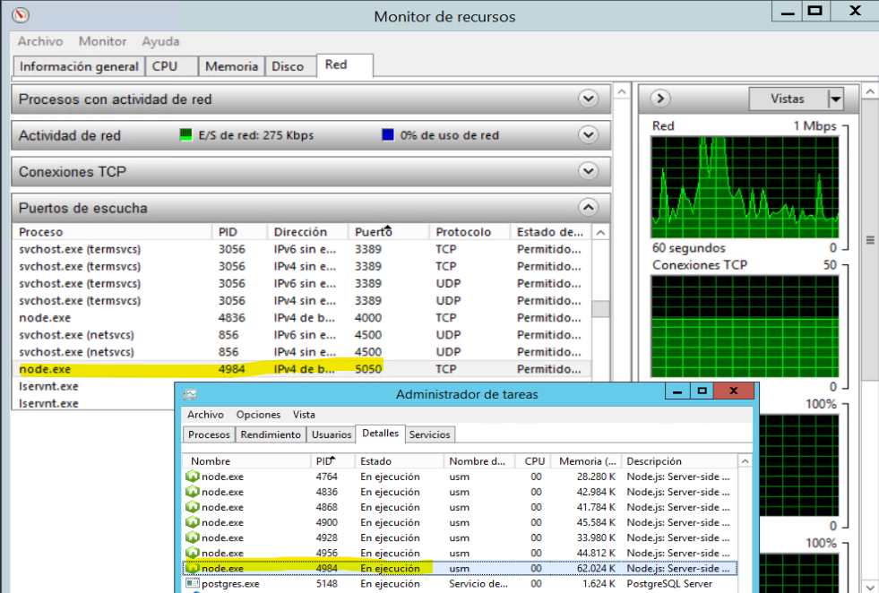

# Departamento de Sistemas

## Instalacines

npm install
npm run dev

## Correr en produccion

npm run build

## Configurar funcionalidades

npm run config

## Actualizar back
### Se debe buscar y eliminar el proceso por el cual corre el puerto definido en el .env

